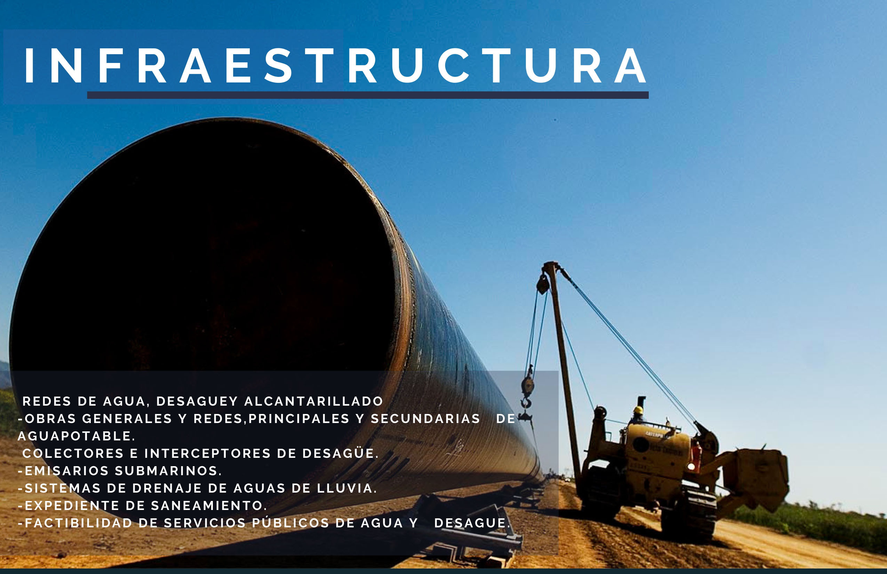
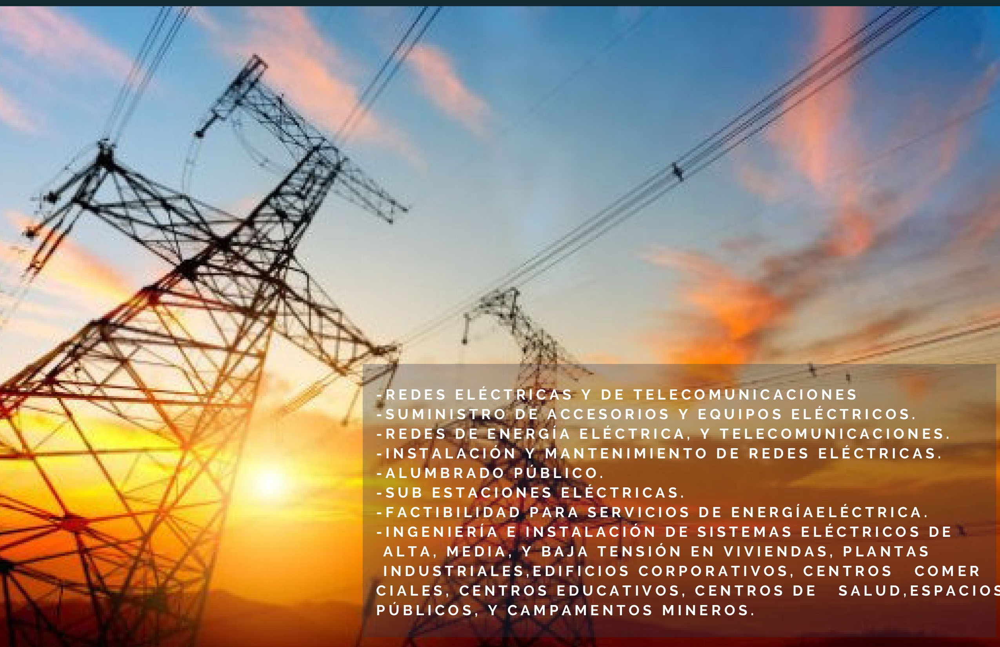

# Infraestructura
Redes de agua, desaguey alcantarillado:
    - Obras generalesy redes principales y secundarias de agua potable.
    - Colectores e interceptores de desague.
    - Emisarios Submarinos.
    - Sistemas de Drenaje de aguas de lluvia.
    - Expediente de saneamiento.
    - Factibilidad de servicios públicos de agua y desague.
    - Redes eléctricas y de telecomunicaciones.
    - Suministro de accesorios y equipos eléctricos.
    - Redes de energía eléctrica, y telecomunicaciones.
    - Instalación y mantenimiento de redes eléctricas.
    - Alumbrado Público.
    - Sub estaciones eléctricas.
    - Factibilidad para servicios de energía eléctrica.
    - Ingeniería e instalación de sistemas eléctricos de alta, media y baja tensión en viviendas, plantas industriales, edificios corporativos, centros comerciales, centros educativos, centros de salud, espacios públicos y campamentos mineros.
    

